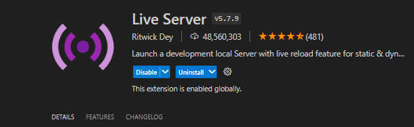
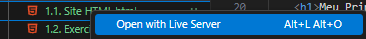

# Introdução ao HTML 📚

HTML (Hypertext Markup Language) é a linguagem de marcação padrão para criar páginas web. Ele descreve a estrutura de uma página web, permitindo a incorporação de elementos como textos, imagens, links, entre outros.

O HTML (HyperText Markup Language) foi criado por Tim Berners-Lee, um cientista da computação britânico, em 1991, enquanto trabalhava no CERN, o Laboratório Europeu de Física de Partículas, na Suíça. O HTML foi fundamental para a criação da World Wide Web, pois permitiu a formatação básica e a criação de links entre documentos online, tornando a web acessível e fácil de usar para um público mais amplo.

No VSCode não esqueça de fazer o download da extensão Live Server! 



Ela irá te ajudar a visualizar rapidamente páginas HTML no seu navegador. É só clicar no HTML com o botão direito e clicar em abrir com Live server.



## Estrutura Básica do HTML 🏗

Todo documento HTML começa com a declaração do tipo de documento `<!DOCTYPE html>`. Seguido por um elemento `<html>` que contém toda a página. Dentro deste, temos dois elementos principais: `<head>` e `<body>`.

```html
<!DOCTYPE html>
<html>
<head>
    <title>Título da Página</title>
</head>
<body>
    <h1>Meu Primeiro Cabeçalho</h1>
    <p>Meu primeiro parágrafo.</p>
</body>
</html>
```

### Tags Básicas! 🏷

- `<h1>` a `<h6>`: Cabeçalhos de diferentes níveis, sendo `<h1>` o mais importante.
- `<p>`: Parágrafo.
- `<a href="URL">`: Link.
- ``: Imagem.
- `<ul>`, `<ol>`, `<li>`: Listas não ordenadas e ordenadas, com itens de lista.
- `<!-- Comentario -->`: Comentario no código.
- `<!DOCTYPE html>`: Define a linguagem da página (neste caso, linguagem de marcação).

Mais exemplos de tags aqui: https://developer.mozilla.org/pt-BR/docs/Web/HTML/Element/

https://developer.mozilla.org/pt-BR/docs/Web/HTML

### Atributos 🛠

Atributos fornecem informações adicionais sobre os elementos. Por exemplo, o atributo `href` em `<a>` especifica o destino do link.

```html
<a href="https://www.exemplo.com">Visite nosso site</a>
```

## Exercícios Práticos 🛠

Para praticar, tente criar uma pequena página HTML com os seguintes elementos:

1. **Título da Página**: Use a tag `<title>` dentro de `<head>` para definir o título da sua página.
2. **Cabeçalho Principal**: Crie um cabeçalho `<h1>` com o texto "Bem-vindo ao Meu Site".
3. **Parágrafo de Introdução**: Abaixo do cabeçalho, adicione um parágrafo `<p>` explicando o propósito do site.
4. **Lista de Itens Favoritos**: Use `<ul>` para criar uma lista não ordenada de seus três itens favoritos, cada um dentro de uma tag `<li>`.
5. **Imagem**: Insira uma imagem de sua escolha usando ``, não esqueça do atributo `alt` para descrever a imagem.
6. **Link**: Por último, adicione um link para um site externo que você gosta, usando a tag `<a>`.

### Exemplo de Resposta

```html
<!DOCTYPE html>
<html>
<head>
    <title>Meu Site de Exemplo</title>
</head>
<body>
    <h1>Bem-vindo ao Meu Site</h1>
    <p>Este site é um exemplo de exercício HTML.</p>
    <ul>
        <li>Café</li>
        <li>Chá</li>
        <li>Chocolate</li>
    </ul>
    
    <a href="https://www.exemplofavorito.com">Meu Site Favorito</a>
</body>
</html>
```

Experimente, explore com as tags, e veja o que você pode criar! HTML é sobre experimentação e aprendizado. Quando você se sentir confortável com esses conceitos básicos, poderá explorar mais elementos e atributos para enriquecer suas páginas web. 🌟